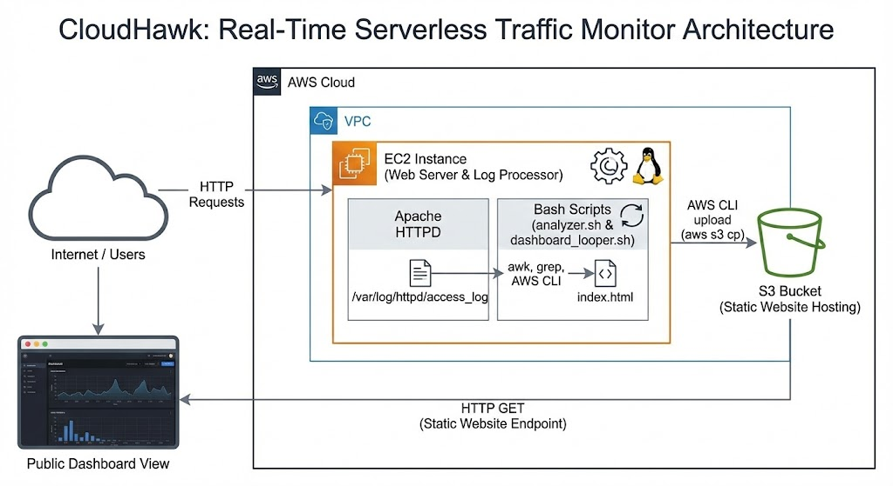

# CloudHawk

CloudHawk is a lightweight, serverless surveillance system that transforms raw Linux server logs into a real-time, dark-mode cybersecurity dashboard hosted on AWS S3. It combines the power of native Linux processing tools with the scalability of the AWS Cloud.




## Features

- **Real-Time Monitoring**: Live dashboard updates every second to show active traffic.
- **Log Analysis**: Automatically parses raw Apache logs for IP addresses and HTTP status codes.
- **Dark Mode UI**: Generates a professional, cyber-themed visual interface.
- **Automated Deployment**: Seamlessly syncs reports to a public AWS S3 bucket.

## Prerequisites

CloudHawk relies on the following powerful tools:
- `AWS CLI`: For secure S3 uploads.
- `Apache HTTPD`: As the web server and log source.
- `Bash`: For the core automation logic.
- `awk` / `grep`: For high-speed text processing and pattern matching.

## Installation

### AWS EC2 Setup (Recommended)

CloudHawk is optimized for Amazon Linux 2023.

1. Clone the repository:
   ```bash
   git clone https://github.com/Hirva-Desai-A/CloudHawk.git
   cd CloudHawk

```

2. Install dependencies:
```bash
sudo yum install httpd -y
sudo systemctl start httpd
sudo systemctl enable httpd

```


3. Configure Permissions:
```bash
chmod +x analyzer.sh dashboard_looper.sh
sudo chmod 755 /var/log/httpd
sudo chmod 644 /var/log/httpd/access_log

```


### Manual Configuration

If you have not set up your AWS credentials yet:

1. Configure the AWS CLI:
```bash
aws configure

```


*Enter your Access Key ID, Secret Access Key, and Region (us-east-1).*
2. Update the Bucket Name:
Edit the script to point to your specific S3 bucket.
```bash
nano analyzer.sh
# Update BUCKET_NAME="your-unique-bucket-name"

```


## Usage

Simply run the automation script in your terminal:

```bash
./dashboard_looper.sh

```

1. The script will initialize and start parsing logs immediately.
2. Visit your **S3 Static Website URL** in your browser.
3. The dashboard will automatically refresh to show:
* **Total Requests**: Visitor count.
* **Security Alerts**: 404/Error count.
* **Top IPs**: A list of the most active visitors.


4. Press `Ctrl+C` in the terminal to stop the monitor.

##  Automated Deployment (Terraform)

If you prefer to deploy the entire CloudHawk infrastructure automatically instead of configuring the server manually, you can use the provided Terraform configuration. 

This setup automatically provisions the S3 bucket, configures IAM roles, launches the EC2 server, installs Apache, clones the repository, and dynamically links the S3 bucket to the analytics script.

## Prerequisites for Terraform
* Terraform installed.
* AWS CLI configured with your credentials.
* An existing SSH Key Pair in your AWS account named `bastion` (Region: `us-east-1`).

## Deployment Steps

1. **Initialize Terraform:**
   In the directory containing your `main.tf` file, run:
   ```bash
   terraform init
2. Deploy the Infrastructure:
Apply the configuration to your AWS account. Type yes when prompted:

```bash
terraform apply
```
Start the Monitor:
Once the deployment is complete, Terraform will output your SSH command and dashboard URL. Log into your new server and start the looper script:

```bash
# Copy the ssh_command provided by Terraform output, for example:
ssh -i bastion.pem ec2-user@<YOUR_EC2_IP>

# Navigate to the repo and run the looper
cd /home/ec2-user/CloudHawk
./dashboard_looper.sh
```
Generate Traffic & View Dashboard:
Visit the traffic_generator_url provided by Terraform a few times to generate some logs, then open the dashboard_url to see your live S3 dashboard!

Cleanup
To avoid unexpected AWS charges, destroy the infrastructure when you are finished monitoring:

```bash
terraform destroy
```
## License

This project is licensed under the MIT License - see the [LICENSE](LICENSE) file for details.

